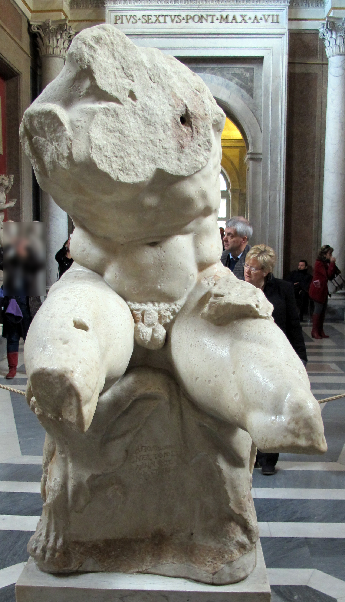

# Auto-Researched Notes

<!-- Generated by auto-research skill. Use /export-notes to generate individual files. -->

## Vatican Museums, Vatican City

<!-- Last updated: 2026-02-01 -->

- [Vatican Museums](https://en.wikipedia.org/wiki/Vatican_Museums)
  - **Type**: Museum
  - **Description**: The public museums of the Vatican City, displaying works from the immense collection amassed by the Catholic Church and the papacy throughout the centuries, including several of the best-known Roman sculptures and most important masterpieces of Renaissance art in the world.

### Artworks

- [Laocoön and His Sons](https://en.wikipedia.org/wiki/Laoco%C3%B6n_and_His_Sons)
  - **Artist**: [Agesander of Rhodes](https://en.wikipedia.org/wiki/Agesander_of_Rhodes), Athenodoros, and Polydorus
  - **Medium**: Marble
  - **Date**: c. 40-30 BC (or possibly later Roman copy of earlier Greek bronze)
  - **Description**: One of the most famous ancient sculptures, excavated in Rome in 1506 and displayed in the Vatican since then. The nearly life-sized group (over 2m high) depicts the Trojan priest Laocoön and his sons Antiphantes and Thymbraeus being attacked by sea serpents. Praised by Pliny the Elder as superior to any work of painting or sculpture.
  

- [Belvedere Torso](https://en.wikipedia.org/wiki/Belvedere_Torso)
  - **Artist**: Apollonios, son of Nestor (Athenian sculptor)
  - **Medium**: Marble
  - **Date**: 1st century BC (likely a copy of an earlier 2nd century BC Greek bronze)
  - **Description**: A 1.59-metre-tall fragmentary marble statue of a seated male nude, known to be in Rome since the 1430s. The identity of the figure remains debated—traditionally identified as Hercules seated on the lion skin, though recent scholarship suggests Ajax contemplating suicide. The statue profoundly influenced Renaissance artists, particularly Michelangelo, who called it his "teacher" and used it as inspiration for figures on the Sistine Chapel ceiling. When Pope Julius II asked Michelangelo to complete the statue with limbs and a head, he refused, declaring it too beautiful to alter.
  

### Artists

- [Agesander of Rhodes](https://en.wikipedia.org/wiki/Agesander_of_Rhodes)
  - **Active**: 1st century BC - 1st century AD
  - **Origin**: Rhodes, Greece
  - Greek sculptor from the island of Rhodes, working in a late Hellenistic "baroque" style. Along with Athenodoros and Polydorus (likely relatives), he is credited with creating the Laocoön group and sculptures discovered at Sperlonga. The three sculptors signed both major works.

- Apollonios, son of Nestor
  - **Active**: 1st century BC
  - **Origin**: Athens, Greece
  - Athenian sculptor known solely through his prominent signature on the base of the Belvedere Torso: "Apollonios, son of Nestor, Athenian." He is unmentioned in ancient literature, and nothing else is known of his life or other works. His masterpiece became one of the most influential ancient sculptures for Renaissance artists.
