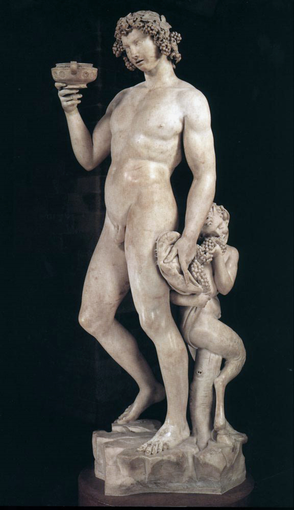

# Bacchus

[Wikipedia](https://en.wikipedia.org/wiki/Bacchus_(Michelangelo))

- **Artist**: [Michelangelo](../artists/Michelangelo.md)
- **Location**: [Bargello](../locations/Bargello.md), Florence
- **Medium**: Marble
- **Date**: 1496-1497

## Description

A marble sculpture of the Roman god of wine, depicted nude with vine leaves and grapes, his body swaying as if affected by alcohol. Michelangelo was paid 160 florins for this work. The sculpture demonstrates his ability to capture both classical ideals and naturalistic observation.

