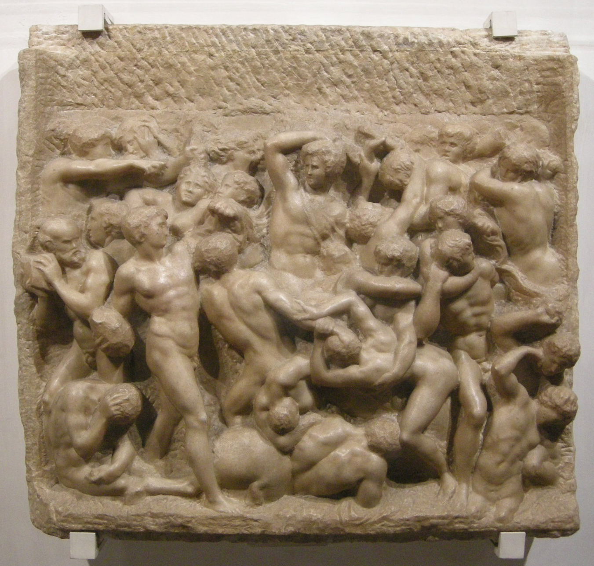

# Battle of the Centaurs

[Wikipedia](https://en.wikipedia.org/wiki/Battle_of_the_Centaurs_(Michelangelo))

- **Artist**: [Michelangelo](../artists/Michelangelo.md)
- **Location**: [Casa Buonarroti](../locations/CasaBuonarroti.md), Florence
- **Medium**: Marble relief
- **Date**: c. 1492

## Description

A marble relief depicting the mythological battle between the Lapiths and Centaurs, created when Michelangelo was about 17 and living in the household of Lorenzo de' Medici. The dynamic composition of intertwined nude figures demonstrates his early interest in the human form in motion.

This was the last work Michelangelo created while under the patronage of Lorenzo de' Medici, who died shortly after its completion. The subject was suggested to Michelangelo by the classical scholar and poet Poliziano, inspired by a classical relief created by Bertoldo di Giovanni. Though unfinished, it demonstrates Michelangelo's fascination with movement and human anatomy that would characterize his mature work.

