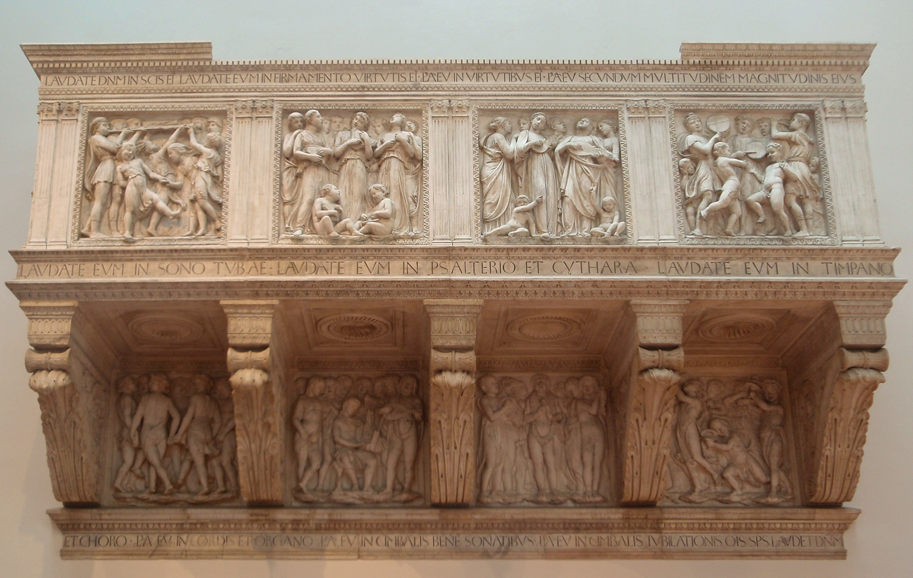

# Cantoria (Luca della Robbia)

[Wikipedia](https://en.wikipedia.org/wiki/Cantoria_(Luca_della_Robbia))

- **Artist**: [Luca della Robbia](../artists/LucaDellaRobbia.md)
- **Location**: [Opera del Duomo Museum](../locations/OperaDelDuomoMuseum.md), Florence
- **Medium**: Marble
- **Date**: 1431–1438
- **Source**: my-study, self-research

## Description

A marble singing gallery (cantoria) originally made for Florence Cathedral. The relief panels depict joyful children and youths singing, dancing, and playing musical instruments, illustrating Psalm 150.

