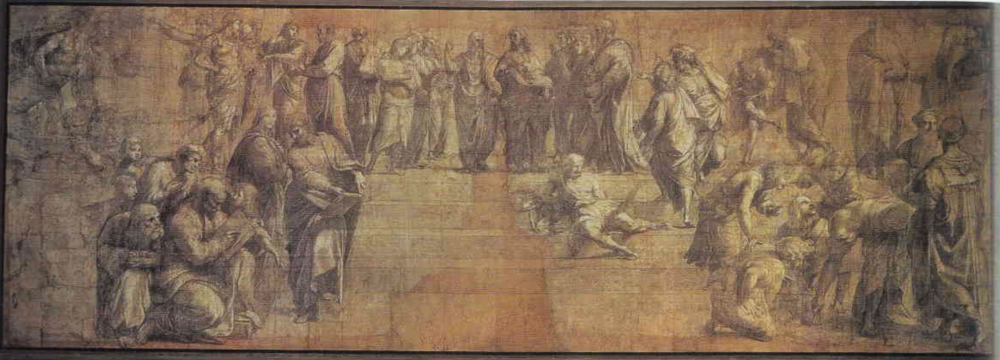

# Cartoon for Philosophy

- **Artist**: [Raphael](../artists/Raphael.md)
- **Location**: [Pinacoteca Ambrosiana](../locations/PinacotecaAmbrosiana.md), Milan
- **Medium**: Charcoal and white chalk on paper
- **Date**: c. 1509-1510

## Description

The preparatory drawing (cartoon) for The School of Athens fresco in the Vatican. Shows Raphael's design process and the development of the composition before painting.

