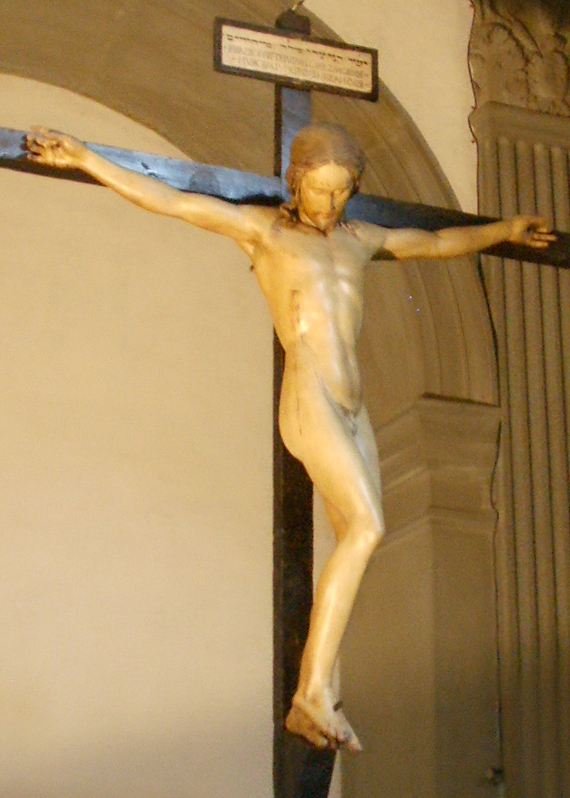

# Crucifix

[Wikipedia](https://en.wikipedia.org/wiki/Crucifix_(Michelangelo))

- **Artist**: [Michelangelo](../artists/Michelangelo.md)
- **Location**: [Santo Spirito](../locations/SantoSpirito.md), Florence
- **Medium**: Polychrome wood
- **Date**: c. 1492

## Biblical Context

[Crucifixion](../biblestories/Crucifixion.md) - Death of Jesus Christ on the cross at Golgotha.

## Description

The only wood work we know for Michelangelo. Created for the church of Santo Spirito in Florence. The slender, delicate figure of Christ differs markedly from Michelangelo's later muscular representations.

