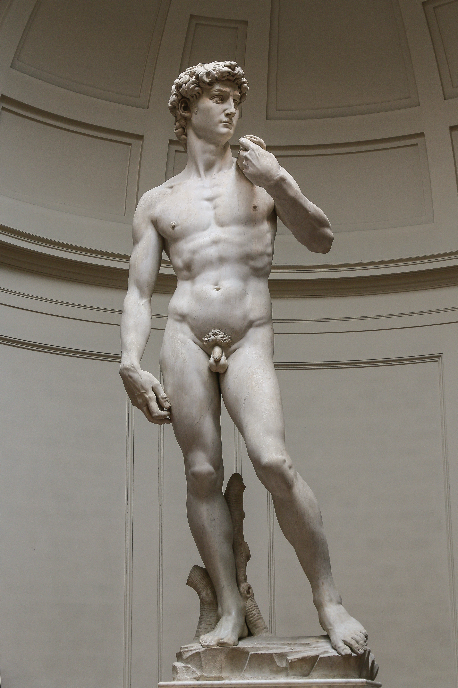

# David

[Wikipedia](https://en.wikipedia.org/wiki/David_(Michelangelo))

- **Artist**: [Michelangelo](../artists/Michelangelo.md)
- **Location**: [Galleria dell'Accademia](../locations/GalleriaDellAccademia.md), Florence
- **Medium**: Marble
- **Date**: 1501-1504
- **Source**: my-study, self-research

## Biblical Context

[David and Goliath](../biblestories/DavidAndGoliath.md) - The young David defeats the giant Philistine warrior Goliath with a sling and stone.

## Description

The commission for Florence cathedral was originally assigned to Agostino di Duccio with a design by Donatello. When Donatello died, the stone was assigned to Michelangelo. The stone was tall but shallow and some work from Agostino had been done already.

The statue was designed to be placed on the Florence cathedral's buttress pedestals, on which the boy could look out over the city, gazing to the north. The statue was ultimately placed in front of Palazzo dei Priori (now Palazzo Vecchio).

The left arm and hand were damaged in 1527 and preserved by Vasari and Francesco Salviati. The original now stands in the Galleria dell'Accademia, while a replica stands in its original location in Piazza della Signoria.

