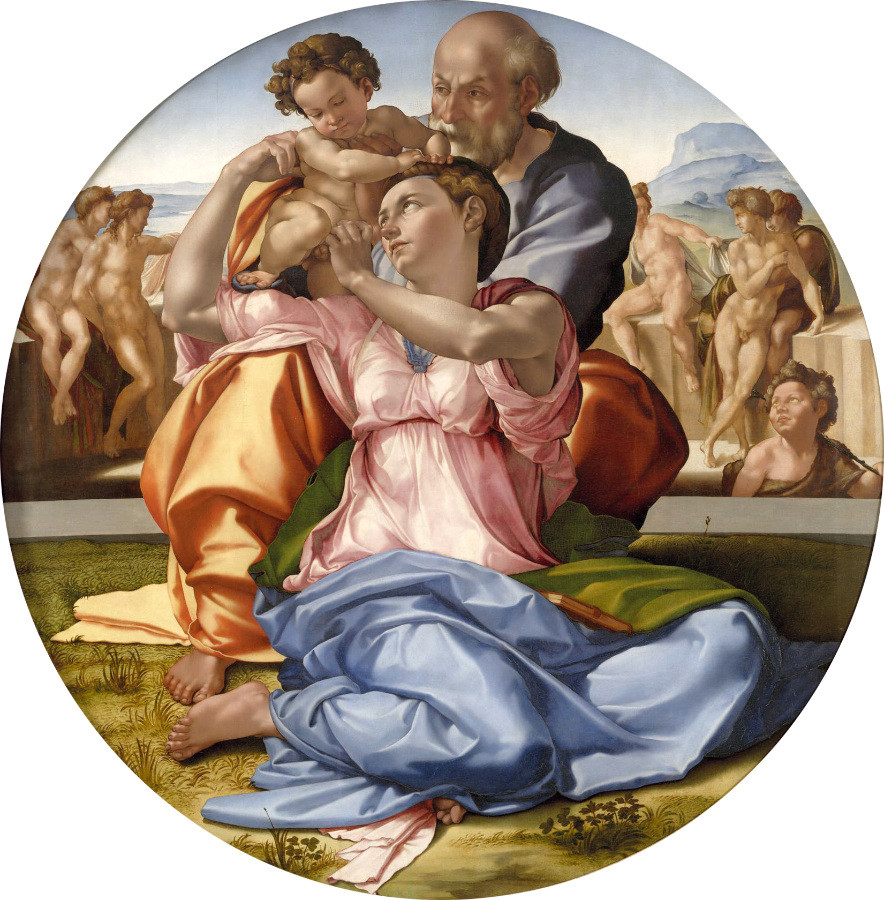

# The Doni Tondo

[Wikipedia](https://en.wikipedia.org/wiki/Doni_Tondo)

- **Artist**: [Michelangelo](../artists/Michelangelo.md)
- **Location**: [Uffizi Gallery](../locations/UffiziGallery.md), Florence
- **Medium**: Tempera on panel
- **Date**: c. 1506

## Biblical Context

[Madonna and Child](../biblestories/MadonnaAndChild.md) - The Virgin Mary with the infant Jesus, here depicted as the Holy Family with St. Joseph.

## Description

The only preserved panel painting of Michelangelo. Also known as "The Dono Madonna" or "Holy Family with St. John the Baptist," this tondo (circular painting) was commissioned by the wealthy Florentine merchant Agnolo Doni. The unusual poses and vibrant colors influenced later Mannerist painters.

