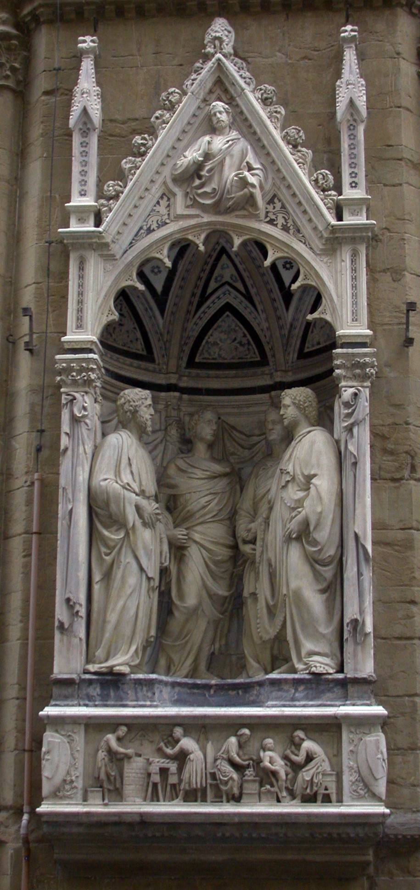

# Four Crowned Martyrs

[Wikipedia](https://en.wikipedia.org/wiki/Quattro_Santi_Coronati_(Nanni_di_Banco))

- **Artist**: [Nanni di Banco](../artists/NanniDiBanco.md)
- **Location**: [Orsanmichele](../locations/Orsanmichele.md), Florence
- **Medium**: Marble
- **Date**: c. 1409–1417

## Description

Part of the sculptural program at Orsanmichele. Commissioned by the guild of stone and wood workers (Arte dei Maestri di Pietra e Legname), this sculptural group shows four Early Christian sculptors—Claudius, Castorius, Symphorian, and Nicostratus—who, according to legend, refused to carve a pagan idol for Emperor Diocletian and were martyred.

The work is remarkable for its classical Roman influence and innovative group composition within a single niche. The four figures engage in conversation, their drapery and poses recalling ancient Roman senatorial statues. This classical reference was particularly appropriate given that the martyrs were sculptors, connecting the guild members to an ancient artistic lineage.

