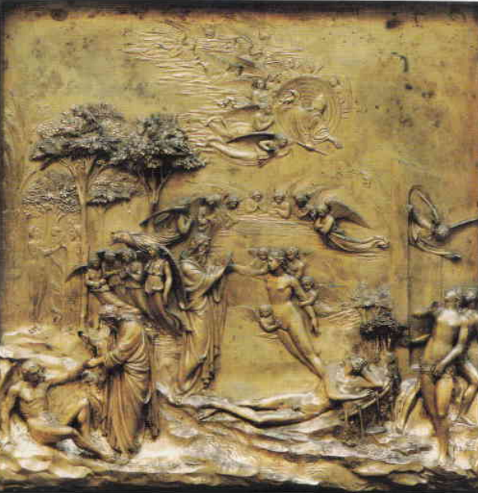

# Gates of Paradise

[Wikipedia](https://en.wikipedia.org/wiki/Gates_of_Paradise)

- **Artist**: [Lorenzo Ghiberti](../artists/LorenzoGhiberti.md)
- **Location**: [Florence Baptistery](../locations/BaptisteryOfFlorence.md), Florence
- **Medium**: Gilded bronze
- **Date**: 1425–1452
- **Source**: my-study, self-research

## Description

The second set of bronze doors Ghiberti created for the Baptistery, depicting Old Testament scenes in ten rectangular panels. Michelangelo reportedly said they were worthy of being the "Gates of Paradise." The original panels are now displayed in glass cases in the Museo dell'Opera del Duomo. Contains the first sensuous female nudes of the Renaissance.

