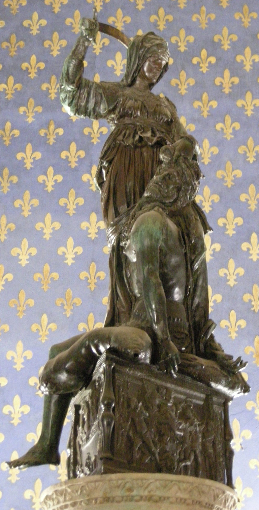

# Judith and Holofernes

[Wikipedia](https://en.wikipedia.org/wiki/Judith_and_Holofernes_(Donatello))

- **Artist**: [Donatello](../artists/Donatello.md)
- **Location**: [Palazzo Vecchio](../locations/PalazzoVecchio.md), Florence
- **Medium**: Bronze
- **Date**: c. 1457–1464
- **Source**: self-research

## Biblical Context

[Judith and Holofernes](../biblestories/JudithAndHolofernes.md) - Judith, a beautiful Jewish widow, saves her city from the Assyrian general Holofernes by entering his camp, gaining his trust, and then beheading him while he slept drunk. The story represents the triumph of virtue over tyranny and of the weak over the powerful.

## Description

Bronze sculpture by Donatello depicting the biblical heroine Judith beheading the Assyrian general Holofernes. Created toward the end of Donatello's career, it is located in the Sala dei Gigli (Hall of Lilies). A copy stands in one of the sculpture's original positions in the Piazza della Signoria.

