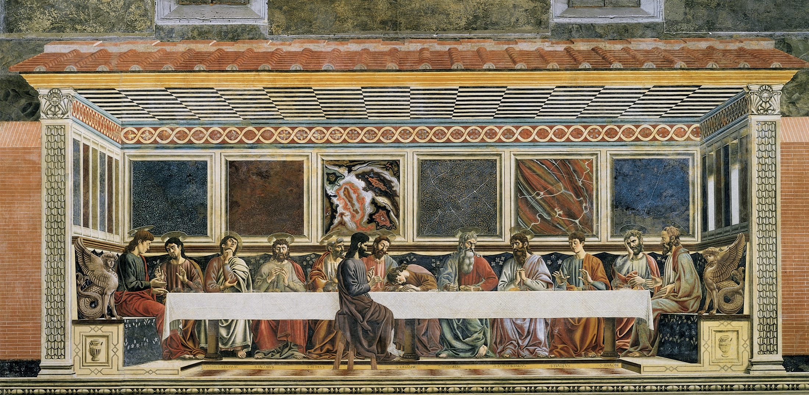

# Last Supper

[Wikipedia](https://en.wikipedia.org/wiki/Last_Supper_(Castagno))

- **Artist**: [Andrea del Castagno](../artists/AndreaDelCastagno.md)
- **Location**: [Sant'Apollonia](../locations/SantApollonia.md), Florence
- **Medium**: Fresco
- **Date**: 1445–1450

## Biblical Context

[Last Supper](../biblestories/LastSupper.md) - Jesus's final meal with his twelve disciples before his crucifixion, during which he instituted the Eucharist (Matthew 26:17-30, Mark 14:12-26, Luke 22:7-38, John 13:1-17:26).

## Description

Considered the first "Last Supper" of the Renaissance in Florence, located in the refectory of the former Benedictine convent of Sant'Apollonia. Judas is depicted sitting separately on the near side of the table, unlike all the other apostles.

The fresco is notable for its perspective illusion, as if the scene was happening in a small room and the viewer was observing from outside. The highly detailed marble walls hearken back to Roman "First Style" wall paintings. Saint John's posture of innocent slumber neatly contrasts with Judas's tense, upright pose.

The fresco was hidden behind plaster for over a century because the convent was cloistered. Vasari did not know of its existence. It may have influenced Leonardo da Vinci's later version, painted about 50 years later.

