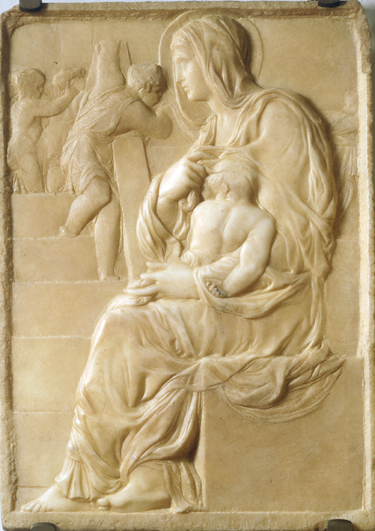

# Madonna of the Stairs

[Wikipedia](https://en.wikipedia.org/wiki/Madonna_of_the_Stairs)

- **Artist**: [Michelangelo](../artists/Michelangelo.md)
- **Location**: [Casa Buonarroti](../locations/CasaBuonarroti.md), Florence
- **Medium**: Marble relief
- **Date**: c. 1491

## Description

An early relief sculpture by Michelangelo, created when he was about 16 years old. Notable for the extraordinary muscular back and right arm of the Christ Child, foreshadowing Michelangelo's later mastery of the human form.

