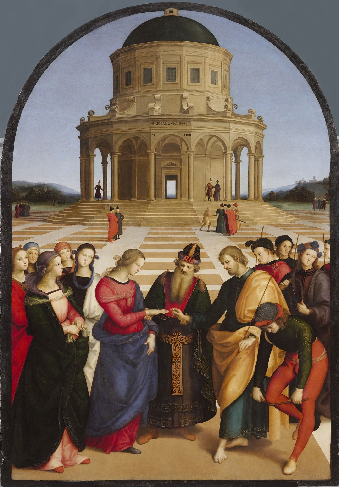

# The Marriage of the Virgin

[Wikipedia](https://en.wikipedia.org/wiki/The_Marriage_of_the_Virgin_(Raphael))

- **Artist**: [Raphael](../artists/Raphael.md)
- **Location**: [Brera](../locations/Brera.md), Milan
- **Medium**: Oil on panel
- **Date**: 1504

## Description

Shows large influence from his teacher Perugino—compare to Perugino's Delivery of the Keys, which has similar figures, ground, and architecture. The painting depicts the marriage of the Virgin Mary to Joseph.

