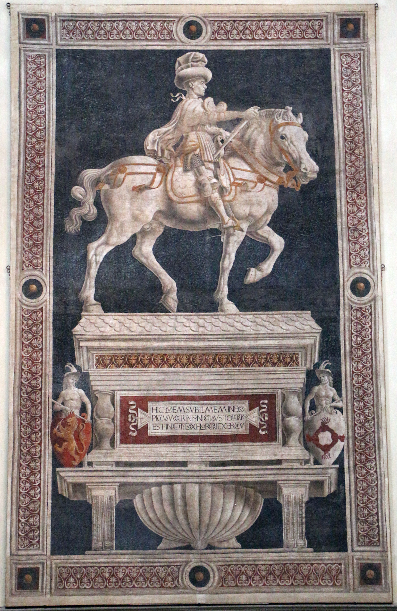

# Equestrian Monument of Niccolò da Tolentino

[Wikipedia](https://en.wikipedia.org/wiki/Equestrian_Monument_of_Niccolò_da_Tolentino)

- **Artist**: [Andrea del Castagno](../artists/AndreaDelCastagno.md)
- **Location**: [Florence Cathedral](../locations/FlorenceCathedral.md), Florence
- **Medium**: Fresco
- **Date**: 1456
- **Source**: my-study, self-research

## Description

A painted equestrian monument honoring the Italian condottiero Niccolò da Tolentino. Located on the left internal wall of the church next to the earlier fresco of John Hawkwood by Paolo Uccello. Both frescoes simulate three-dimensional sculptural monuments through illusionistic painting.

