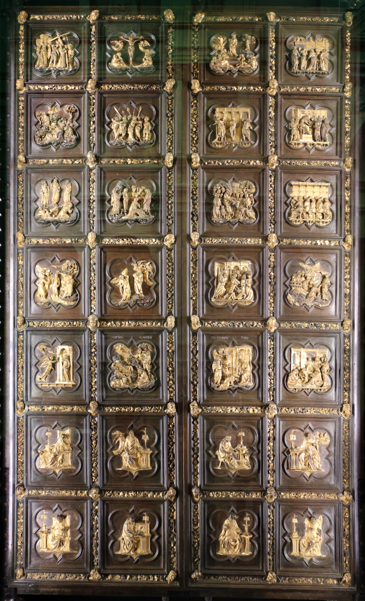

# North Door of Florence Baptistery

[Wikipedia](https://en.wikipedia.org/wiki/North_Doors_of_the_Florence_Baptistery)

- **Artist**: [Lorenzo Ghiberti](../artists/LorenzoGhiberti.md)
- **Location**: [Florence Baptistery](../locations/BaptisteryOfFlorence.md), Florence
- **Medium**: Bronze
- **Date**: 1403–1424
- **Source**: my-study, self-research

## Description

Ghiberti's first masterpiece, made before his celebrated Gates of Paradise. The doors contain scenes from the New Testament in quatrefoil frames. After restoration in 2013-2015, the original doors were displayed in the Museo dell'Opera del Duomo and replaced by a copy on the Baptistery. Created after Ghiberti won the famous competition against Brunelleschi.

