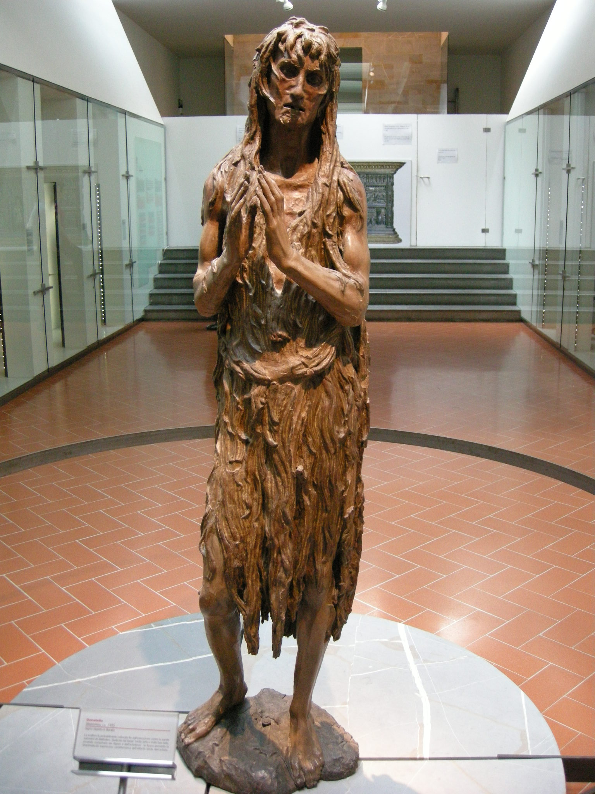

# Penitent Magdalene

[Wikipedia](https://en.wikipedia.org/wiki/Penitent_Magdalene_(Donatello))

- **Artist**: [Donatello](../artists/Donatello.md)
- **Location**: [Opera del Duomo Museum](../locations/OperaDelDuomoMuseum.md), Florence
- **Medium**: Wood (polychrome)
- **Date**: c. 1440
- **Source**: my-study, self-research

## Biblical Context

[Mary Magdalene](../biblestories/MaryMagdalene.md) - Mary Magdalene as a penitent figure, based on the medieval tradition that conflated her with the unnamed sinful woman in Luke.

## Description

A powerful wooden sculpture of Mary Magdalene, probably commissioned for the Florence Baptistery. The piece was received with astonishment for its unprecedented realism, depicting the penitent saint as an emaciated, aging figure. Late work by Donatello demonstrating his expressive late style.

