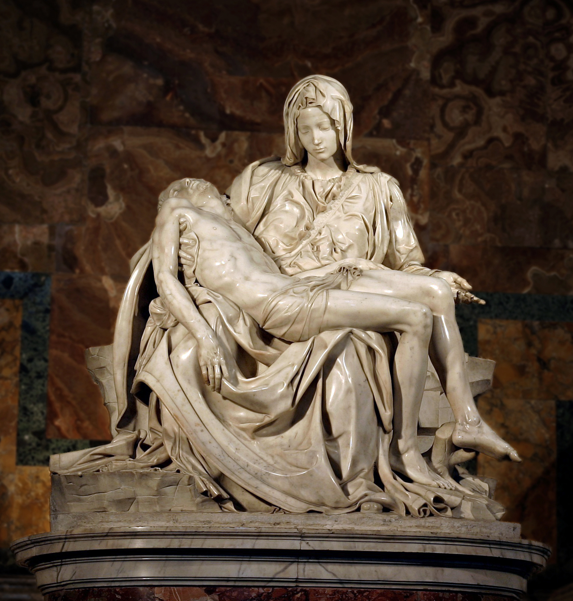

# Pietà

[Wikipedia](https://en.wikipedia.org/wiki/Piet%C3%A0_(Michelangelo))

- **Artist**: [Michelangelo](../artists/Michelangelo.md)
- **Location**: [St. Peter's Basilica](../locations/StPetersBasilica.md), Vatican
- **Medium**: Marble
- **Date**: 1498-1499

## Biblical Context

[Lamentation](../biblestories/Lamentation.md) - The mourning over Christ's body after his death on the cross.

## Description

Created when Michelangelo was only 23 years old. The sculpture was designed to be placed on or near the floor, so the viewer can see Christ's face better. It is the only work Michelangelo ever signed, reportedly after overhearing viewers attribute it to another sculptor.

