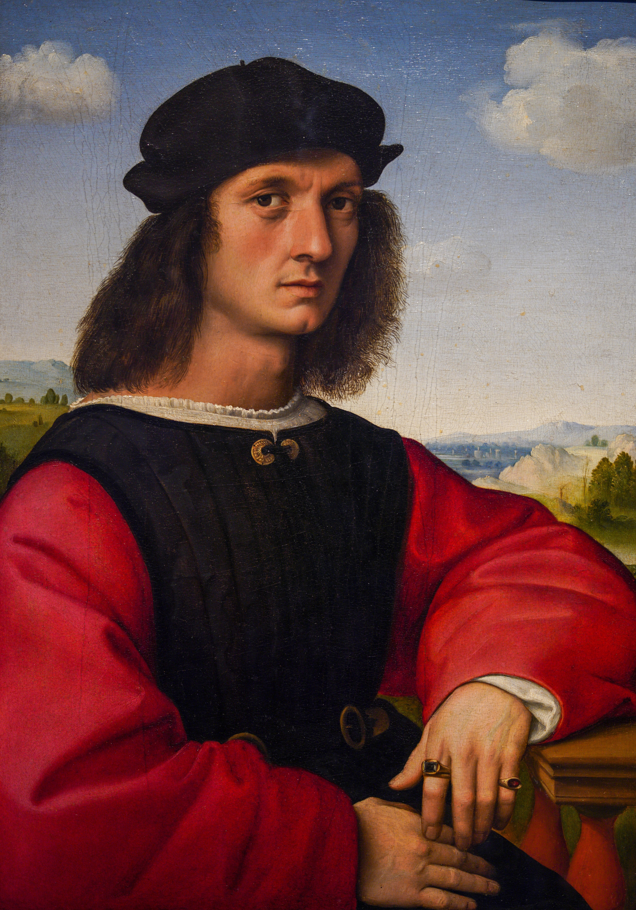

# Portrait of Agnolo Doni

[Wikipedia](https://en.wikipedia.org/wiki/Portrait_of_Agnolo_Doni)

- **Artist**: [Raphael](../artists/Raphael.md)
- **Location**: [Uffizi Gallery](../locations/UffiziGallery.md), Florence
- **Medium**: Oil on panel
- **Date**: c. 1506

## Description

A portrait of the wealthy Florentine merchant Agnolo Doni (who also commissioned Michelangelo's Doni Tondo). The composition resembles that of the Mona Lisa, but with more details on the material of cloth and jewels. Painted as a pair with the Portrait of Maddalena Doni.

