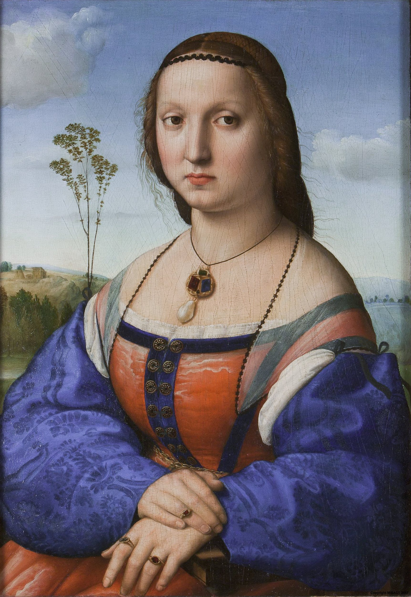

# Portrait of Maddalena Doni

[Wikipedia](https://en.wikipedia.org/wiki/Portrait_of_Maddalena_Strozzi)

- **Artist**: [Raphael](../artists/Raphael.md)
- **Location**: [Uffizi Gallery](../locations/UffiziGallery.md), Florence
- **Medium**: Oil on panel
- **Date**: c. 1506

## Description

A portrait of Maddalena Strozzi, wife of Agnolo Doni. The composition resembles that of the Mona Lisa, but with more details on the material of cloth and jewels. Painted as a pair with the Portrait of Agnolo Doni.

