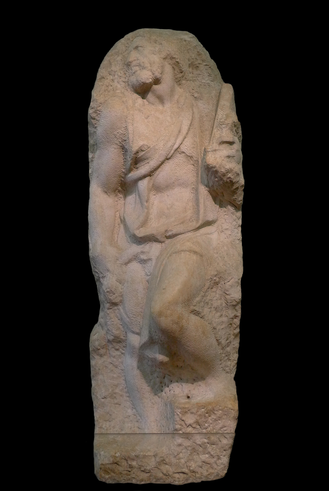

# Saint Matthew

[Wikipedia](https://en.wikipedia.org/wiki/Saint_Matthew_(Michelangelo))

- **Artist**: [Michelangelo](../artists/Michelangelo.md)
- **Location**: [Galleria dell'Accademia](../locations/GalleriaDellAccademia.md), Florence
- **Medium**: Marble (unfinished)
- **Date**: c. 1505-1506

## Description

One of a series of 12 apostle statues commissioned for the interior of the Florence Cathedral (Duomo) that was never begun. This unfinished work shows Michelangelo's sculptural process—the figure appears to be emerging from the block of marble, demonstrating his concept that the sculptor's task is to liberate the form already present within the stone.

