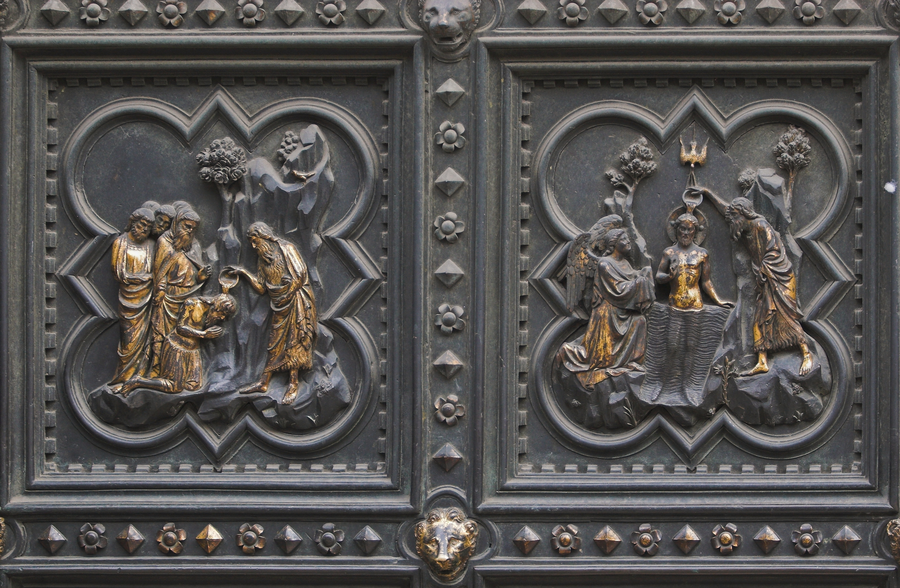

# South Door of Florence Baptistery

- **Artist**: [Andrea Pisano](../artists/AndreaPisano.md)
- **Location**: [Florence Baptistery](../locations/BaptisteryOfFlorence.md), Florence
- **Medium**: Bronze
- **Date**: 1330–1336
- **Source**: my-study, self-research

## Biblical Context

[John the Baptist](../biblestories/JohnTheBaptist.md) - The doors depict scenes from the life of John the Baptist, the patron saint of Florence.

## Description

The earliest of the three bronze door sets for the Baptistery. The doors contain 28 quatrefoil panels depicting scenes from the life of John the Baptist and allegorical figures of the Virtues.

