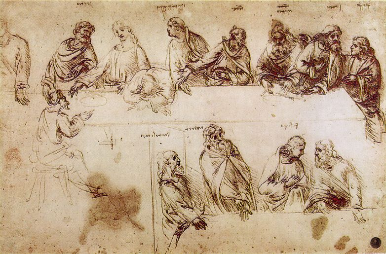

# Study of Composition of Last Supper

- **Artist**: [Leonardo da Vinci](../artists/LeonardoDaVinci.md)
- **Location**: [Gallerie dell'Accademia](../locations/Accademia.md), Venice
- **Medium**: Drawing

## Description

Preparatory study for [The Last Supper](LastSupperLeonardo.md) showing that Judas was originally placed at our side of the table, which is not the case in the final artwork.

