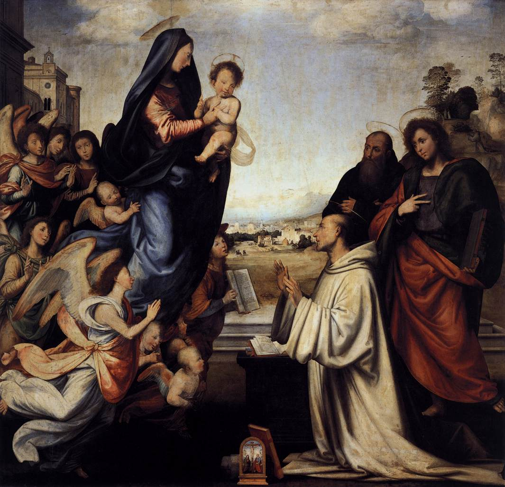

# The Vision of Saint Bernard

[Wikipedia](https://en.wikipedia.org/wiki/The_Vision_of_Saint_Bernard_(Fra_Bartolomeo))

- **Artist**: [Fra Bartolommeo](../artists/FraBartolommeo.md)
- **Location**: [Uffizi Gallery](../locations/UffiziGallery.md), Florence
- **Medium**: Oil on panel
- **Date**: 1504-1507

## Description

Depicts the mystical vision of Saint Bernard of Clairvaux, in which the Virgin Mary appeared to him. This work influenced Raphael and shows Fra Bartolommeo's mature style with soft modeling and harmonious composition.

