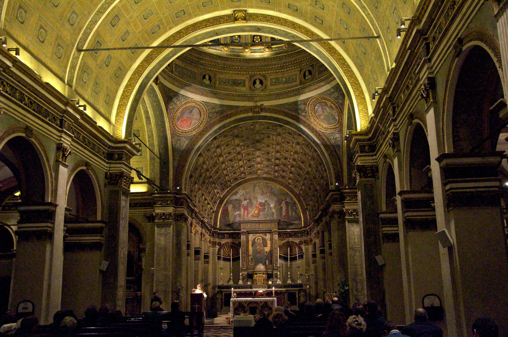

# Chiesa di Santa Maria presso San Satiro

[Wikipedia](https://en.wikipedia.org/wiki/Santa_Maria_presso_San_Satiro)

[GoogleMap](https://maps.app.goo.gl/DCNVR31bGVSKaSfx8)

Milan, Italy

**Type**: Church
**Architectural style**: Renaissance

A church in Milan designed by Donato Bramante, featuring a carefully calculated illusory choir. Due to space constraints, Bramante created a trompe-l'oeil perspective that gives the illusion of a deep apse when in reality it is only about a meter deep.

