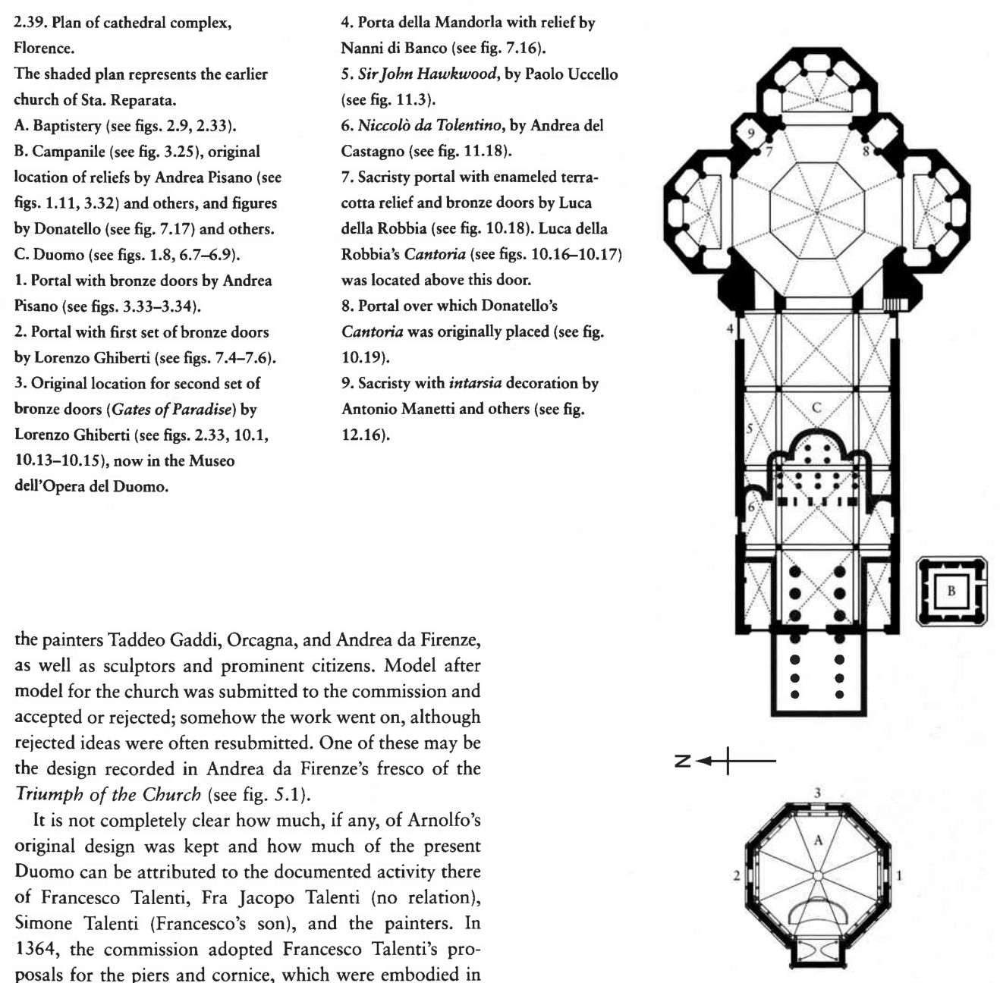
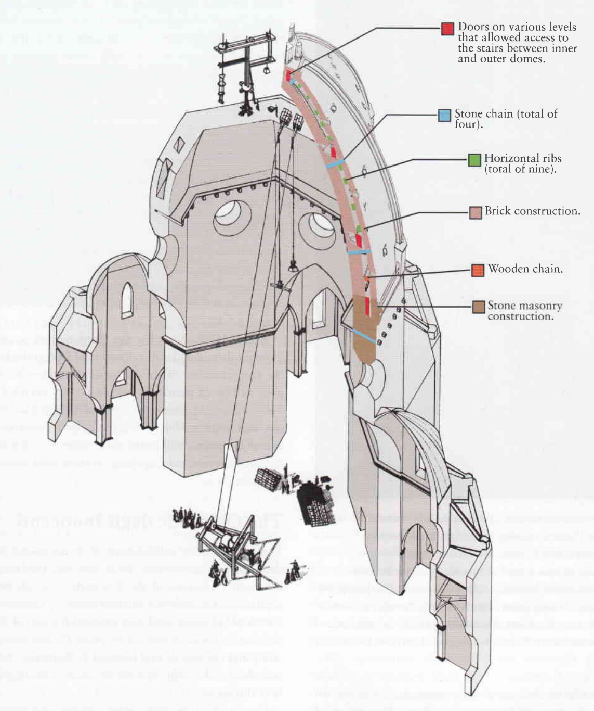
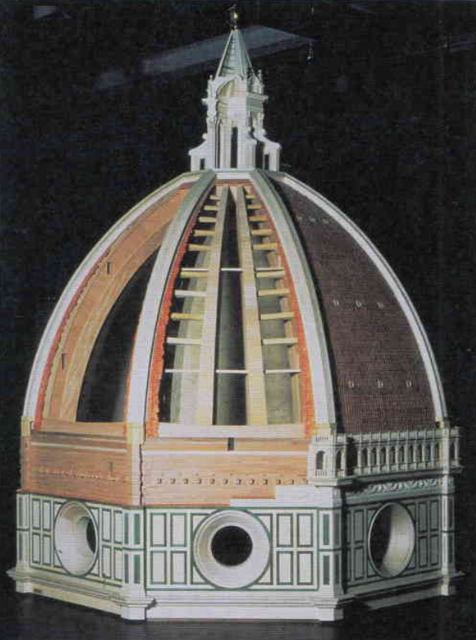
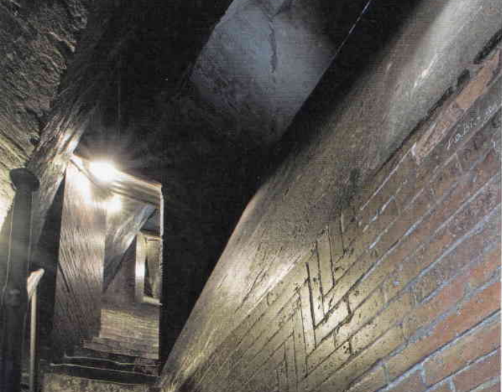

# Florence Cathedral

[Wikipedia](https://en.wikipedia.org/wiki/Florence_Cathedral)

[GoogleMap](https://maps.google.com/?q=Florence%20Cathedral%2C%20Florence%2C%20Italy)

Florence, Italy

**Type**: Cathedral / Basilica
**Architectural style**: Gothic, Renaissance dome
**Source**: my-study, self-research

AKA Cathedral of Santa Maria del Fiore (Duomo). Formally the Cathedral of Saint Mary of the Flower, this is the cathedral of the Catholic Archdiocese of Florence. Commenced in 1296 in the Gothic style to a design of [Arnolfo di Cambio](../artists/ArnolfoDiCambio.md) and completed by 1436 with a dome engineered by [Filippo Brunelleschi](../artists/FilippoBrunelleschi.md), the basilica's exterior is faced with polychrome marble panels in various shades of green and pink, alternated by white, and features an elaborate 19th-century Gothic Revival western façade.

## Architecture

### [Dome](../artworks/DomeOfFlorenceCathedral.md)
- **Architect**: [Filippo Brunelleschi](../artists/FilippoBrunelleschi.md)
- Exactly half as wide as it is tall

## Artworks

### [The Last Judgement (Vasari and Zuccari)](../artworks/LastJudgementVasariZuccari.md)
- **Artist**: [Giorgio Vasari](../artists/GiorgioVasari.md) and [Federico Zuccari](../artists/FedericoZuccari.md)
- **Medium**: Fresco
- **Date**: 1572-1579

A monumental fresco covering the interior of Brunelleschi's dome. Initially commissioned by Grand Duke Cosimo I de' Medici, it was begun by Giorgio Vasari in 1572 and completed after his death by Federico Zuccari in 1579.

### [Funerary Monument of John Hawkwood](../artworks/FuneraryMonumentJohnHawkwood.md)
- **Artist**: [Paolo Uccello](../artists/PaoloUccello.md)

### [Equestrian Monument of Niccolò da Tolentino](../artworks/NiccoloDaTolentino.md)
- **Artist**: [Andrea del Castagno](../artists/AndreaDelCastagno.md)

### [Dante Before the City of Florence](../artworks/DanteBeforeTheCityOfFlorence.md)
- **Artist**: [Domenico di Michelino](../artists/DomenicoDiMichelino.md)
- **Medium**: Painting
- **Date**: 1465

### [The Deposition (Florentine Pietà)](../artworks/FlorentinePieta.md)
- **Artist**: [Michelangelo](../artists/Michelangelo.md)
- **Medium**: Marble sculpture
- **Date**: 1547-1555
- Now housed in the Museo dell'Opera del Duomo

## Associated Sites

### [Giotto's Campanile](../locations/GiottosCampanile.md)
- **Type**: Bell Tower
- **Architect**: [Giotto di Bondone](../artists/GiottoDiBondone.md) (begun), Andrea Pisano, Francesco Talenti
- **Date**: 1334-1359

### [Florence Baptistery](../locations/BaptisteryOfFlorence.md)
- Famous for the bronze doors by Andrea Pisano and Lorenzo Ghiberti, including the "Gates of Paradise"

### [Museo dell'Opera del Duomo](../locations/OperaDelDuomoMuseum.md)
- Houses original works of art from the cathedral complex
