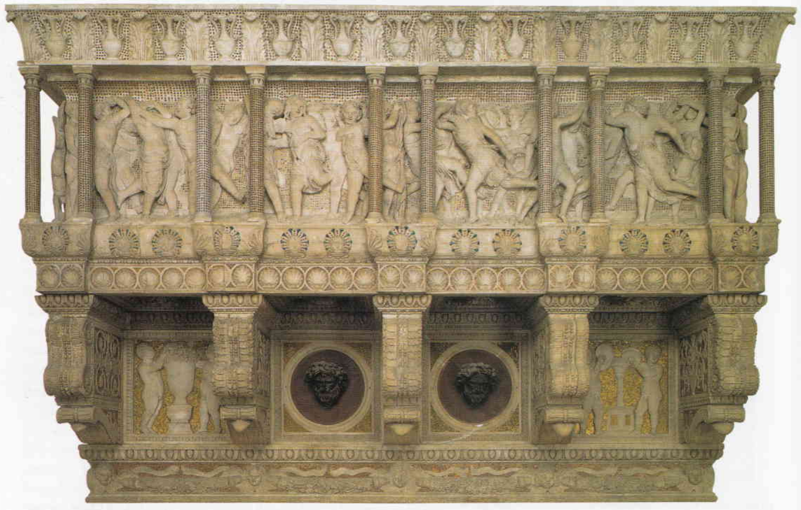

# Opera del Duomo Museum

[Wikipedia](https://en.wikipedia.org/wiki/Museo_dell%27Opera_del_Duomo_(Florence))

[GoogleMap](https://maps.google.com/?q=Museo%20dell%27Opera%20del%20Duomo%2C%20Florence%2C%20Italy)

Florence, Italy

**Type**: Museum
**Source**: my-study, self-research

A museum containing many of the original works of art created for [Florence Cathedral](../locations/FlorenceCathedral.md), including the adjacent [Florence Baptistery](../locations/BaptisteryOfFlorence.md) and [Giotto's campanile](../locations/GiottosCampanile.md). Most exterior sculptures have been removed from these buildings, usually replaced by replica pieces, with the museum conserving the originals. Houses "one of the world's most important collections of sculpture," including the famous Cantorie (singing galleries) by Luca della Robbia and Donatello.

## Artworks

### [Creation of Adam](../artworks/CreationOfAdam.md)
- **Artist**: [Andrea Pisano](../artists/AndreaPisano.md)

### [Cantoria (Luca della Robbia)](../artworks/CantoriaLucaDellaRobbia.md)
- **Artist**: [Luca della Robbia](../artists/LucaDellaRobbia.md)

### [Cantoria (Donatello)](../artworks/CantoriaDonatello.md)
- **Artist**: [Donatello](../artists/Donatello.md)

### [Penitent Magdalene](../artworks/PenitentMagdalene.md)
- **Artist**: [Donatello](../artists/Donatello.md)
- **Medium**: Wood (polychrome)

### [The Deposition (Florentine Pietà)](../artworks/FlorentinePieta.md)
- **Artist**: [Michelangelo](../artists/Michelangelo.md)
- **Medium**: Marble sculpture

### [Zuccone (Prophet Habakkuk)](../artworks/Zuccone.md)
- **Artist**: [Donatello](../artists/Donatello.md)
- **Medium**: Marble

### [North Doors of the Florence Baptistery](../artworks/NorthDoor.md)
- **Artist**: [Lorenzo Ghiberti](../artists/LorenzoGhiberti.md)
- **Medium**: Bronze
- Originally displayed on the Baptistery, now in the museum after 2013-2015 restoration

### [Gates of Paradise](../artworks/GatesOfParadise.md)
- **Artist**: [Lorenzo Ghiberti](../artists/LorenzoGhiberti.md)
- **Medium**: Gilded bronze
- Original panels displayed in glass cases in the museum

### [South Doors of the Florence Baptistery](../artworks/SouthDoorFlorenceBaptistery.md)
- **Artist**: [Andrea Pisano](../artists/AndreaPisano.md)
- **Medium**: Bronze

### [Madonna with Glass Eyes](../artworks/MadonnaWithGlassEyes.md)
- **Artist**: [Arnolfo di Cambio](../artists/ArnolfoDiCambio.md)
- **Medium**: Marble with glass inlay
